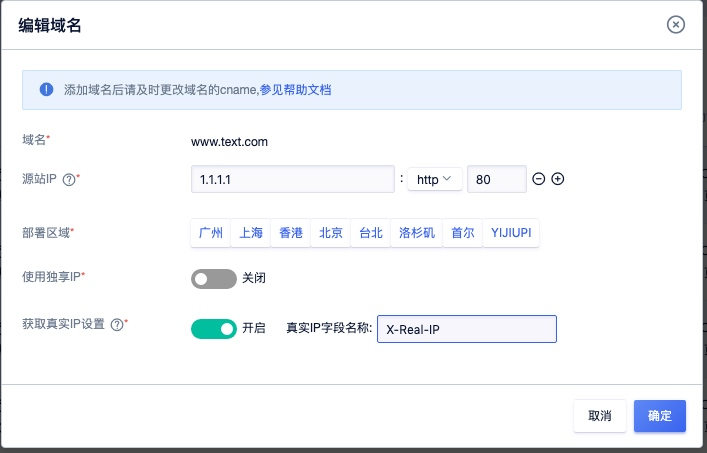

# 常见基础问题汇总

### 如何获取访问网站客户的原始IP

WAF会请求头中通过 X-Real-IP 和 X-Forwarded-For 两个字段来传递来访用户的真实IP，请在源站服务器中配置并获取它们的值。

在Web应用程序中，可以通过下面的方法来获取：

``` 
  –ASP
  Request.ServerVariables(“X-Real-IP”)
  –PHP
  $_SERVER[“X-Real-IP”]
  –JSP
  request.getHeader(“X-Real-IP”)
```

备注：如果上层链路为CDN等第三方代理，有可能无法获取真实IP。

### 最新的高危漏洞出现WAF是否会支持防护

每当爆出最新漏洞的时候，我们的运营人员会第一时间跟进，分析POC和漏洞原理，提取相应的检测规则，及时部署新规则到WAF系统。

### WAF支持虚拟补丁，什么是虚拟补丁？

WAF系统对漏洞攻击的阻断称为“虚拟补丁”，意味着并非是真正的打补丁行为，而是临时封堵攻击，为业务方更新补丁赢取时间。

### 如果我们有ULB负载网关，是否就直接填写负载网关的IP还是填写子网主机IP

如果有ULB网关，则填写网关的IP即可，无需子网主机IP。

### WAF是否支持HTTPS？

支持，托管SSL证书（在控制台上传）之后，WAF可以防护HTTPS的流量。

### 如何获取CDN的真实IP？
默认CDN会通过XFF来传递客户的真实IP，但是不排除用户伪造请求IP的情况出现。
以UCDN举例，如果想要用真实的IP进行信息判断，需要做如下操作

1. 在WEB应用防火墙  --->  域名管理，选中需要设置的域名，点击编辑
2. 打开后，开启获取真实IP设置，在真实IP字段填入 X-Real-IP 字段（该字段为UCDN传递真实IP客户，如选择其他第三方代理，请与其供应商确认真实IP字段）


4. 配置完成后，点击确定，即可完成获取真实IP操作


