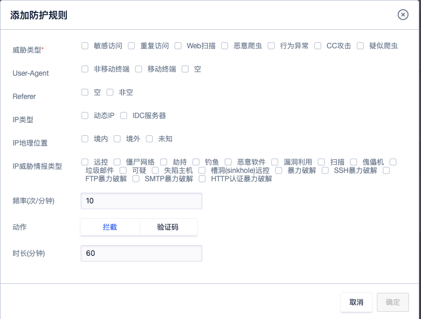

{{indexmenu_n>6}}

# 机器行为检测


机器行为检测基于大数据分析引擎检测，对于检测出的结果联动waf的拦截功能可以精确的控制bot的访问。

`注意：如果接入了cdn则配置可能无效，请联系技术支持寻求定制化的帮助。`

页面布局参数说明：

  - 域名：当前的检测域名
  - 来源IP：请求的来源IP地址
  - 行为类型：识别出的攻击行为
  - 特征值：
  - 开始时间：开始请求的时间
  - 状态：处理动作
  - 操作：
    1.  详情：查看具体的请求内容
    2.  加入黑名单：对该IP的后续请求加入黑名单处理
    3.  忽略：不做处理

机器行为分为两类，正常的和恶意的。正常的机器行为主要分3类：

    1. 搜索引擎的爬虫
    2. 自动化完成的业务逻辑（例如应用自动提取关联信息以及一些自动化工具的统计类工作）
    3. 监控机器人，主要用于网站可用性等指标的实时监控

恶意的机器行为能做的事情就非常广泛了，介绍如下：

```
1. 僵尸网络发起的ddos以及cc攻击
2. 接口烂刷：比如刷票，羊毛党，短信接口，垃圾注册等等
3. 垃圾邮件机器人
4. 自动化扫描工具，探测网站潜在漏洞，为后续攻击收集情报
5. 不规范搜索引擎的爬虫，不遵循robots.txt规范，频繁抓取数据，形成大量垃圾记录
6. 恶意爬虫，抓取网站数据，尤其是来自竞争对手的抓取
7. 恶意行为，多为模拟人操作特征，但是访问逻辑异常，多为网站存在漏洞被发现，攻击者专门开发的恶意程序的访问

```

异常检测并不困难，基于机器学习技术能构建多种异常检测模型来识别潜在的bot。目前ucloud使用行为基线模型效果比较突出。例如一个精心构造的爬虫工具，专门针对感兴趣的目标url提取数据，请求速率下降到和搜索引擎一样，每分钟请求0.5-1次，ua也伪造为搜索引擎的。行为模型会跟踪这个访问行为，对访问的目标url进行基线距离计算，就能检测出此异常。基于此方法，bot类的访问都能检测出，不论是正常的bot（机器行为）还是恶意的bot（机器行为）。

## 添加防护规则



**封堵时长（分钟）：** 指动作为“拦截”时，不允许访问域名的时长；当动作为“验证码”时，验证码校验不通过，不允许访问域名的时长。

**动作：**可选“拦截”或“验证码”。

* 拦截：阻止匹配的请求访问域名下的所有路径

* 验证码：当发现匹配的请求，则会进入验证码校验页面，如果校验不通过，会被拦截。如果验证码通过验证，30分钟有效期不会再弹验证码。

### 匹配条件配置


==所有指标的可选项之间都是or的关系，只要满足其中一个即可。比如选择了IP地理位置的境内、境外和未知，则只要满足其中一个就可以跟其他条件继续组合。==

例子：

1.敏感访问（威胁类型）+移动终端（User-Agent）+境内（IP地理位置）+扫描/傀儡机/僵尸网络/远控（IP威胁情报类型） 60次/分钟
拦截 60分钟

2.web扫描（威胁类型）+移动终端（User-Agent）+境外（IP地理位置）+扫描/傀儡机/僵尸网络/远控（IP威胁情报类型）
60次/分钟 拦截 60分钟


**表示**

1.发现境内移动终端来源IP，且这些IP曾经被标记为“扫描、或者傀儡机、或者僵尸网络、或者远控”的，访问行为被识别为敏感访问时，这种情况超过了每分钟60次，则将触发拦截60分钟。

2.发现境外移动终端来源IP，且这些IP曾经被标记为“扫描、或者傀儡机、或者僵尸网络、或者远控”的，访问行为被识别为web扫描时，这种情况超过了每分钟60次，则将触发拦截60分钟。

1和2的触发互相独立。

### 1、威胁类型

系统内置的威胁类型包括以下几类，可以根据使用的场景选择合适的威胁类型。

**敏感访问：**访问域名时含有敏感信息，例如登录注册短信等敏感接口的访问，可能是黑客在尝试破解密码、撞库攻击。

**重复访问：** 分析发现请求具有重复访问的模式，例如访问同一个url但是参数不同，这类访问通常是爬虫、cc攻击的一个显著特征。

**Web扫描：** 检测是否有人在通过web扫描工具探测网站的弱点。

**恶意爬虫：** 搜索引擎的爬虫是正常的爬虫，除此以外的爬虫比如搜集信息进行比价，留下垃圾记录等，系统将视此类爬虫为恶意爬虫。

**行为异常：** 模型会学习到网站访问的行为基线不符合基线的，而且不符合已知的、其他类别的都会归类为行为异常。

**CC攻击：** 通过人工智能判断的cc攻击行为，非同一个IP访问的cc攻击也可以判断出来

**疑似爬虫：** 存在一定概率误判的爬虫，适合严格控制爬虫行为的客户进行选择

### 2、User-Agent

User-Agent 表示http的请求的ua类型，3个可选值：移动终端(比如手机，平板)，非移动终端包含pc浏览器等，空表示请求的ua为空。

### 3、Refer

Refer：代表网页的来源，及上一页的地址。如果是直接在浏览器上输入地址，回车进来，则没有Refer头。

目前只支持设置Refer为空或者非空，如果非空则表示是从其他页面跳转过来的，可以是站内的，也可以是站外的。

### 4、IP类型

IP类型主要是区分动态ip和IDC IP，==大多数的恶意攻击都来自已经被入侵控制的IDC服务器。==

动态IP地址(Dynamic IP)指的是在需要的时候才进行IP地址分配的方式。由于IP地址资源很宝贵，因此大部分用户上网都是使用动态IP地址的，比如通过Modem、ISDN、ADSL、有线宽频、小区宽频等方式上网的计算机，都是在每次上网的时候临时分配一个IP地址。

因此，此处建议只选择IDC IP即可。

### 5、IP地理位置

IP地理位置可选“境内”、“境外”和“未知”。由于地址库更新不及时的原因，IP的地理信息获取不到时将会判断为“未知”。

### 6、IP威胁情报类型

根据大数据分析得出的威胁情报，使用者可以做进一步的精准过滤。

**远控：** 指来源的访问IP是被远程控制的。

**僵尸网络：** 指来源的访问IP是僵尸网络中被控制的主机。僵尸网络 Botnet
是指采用一种或多种传播手段，将大量主机感染bot程序（僵尸程序）病毒，从而在控制者和被感染主机之间所形成的一个可一对多控制的网络

**劫持：** 指来源的访问IP是被劫持的IP。

**钓鱼：** 指来源的访问IP是钓鱼网站的IP。

**恶意软件：** 指访问来源IP曾经发现有恶意软件。

**漏洞利用：** 指来源的访问IP曾经发起过漏洞利用的攻击。

**扫描：** 指访问来源IP曾经被发现有恶意扫描的行为。

**傀儡机：** 傀儡机也叫肉鸡，也就是被黑客远程控制的机器。黑客通过黑客软件对别人进行攻击，如果有人中了这种病毒的话，病毒就会在系统开一个后门，方便黑客在需要的时候对你的计算机进行控制或其他的操作，这时被黑客操纵的计算机就叫傀儡机。

**垃圾软件：** 指一些恶意网站会误导用户安装用户不想安装的垃圾软件。

**可疑：** 疑似的有过恶意行为的访问来源IP。

**失陷主机：** 指内部主机被黑客控制，具有隐蔽性高，危害大的特点。

**槽洞（sinkhole）远控：** 一种针对路由层的攻击，攻击者的目标是尽可能地引诱一个区域中的流量通过一个恶意节点（或已遭受入侵的节点），进而制造一个以恶意节点为中心的“接受
洞”，一旦数据都经过该恶意节点，节点就可以对正常数据进行篡改，并能够引发很多其他类型的攻击。

**暴力破解：** 暴力破解一般指穷举法找到正确的用户名和密码。

**SSH暴力破解：** 暴力破解对象是SSH的用户名和密码。

**FTP暴力破解：** 暴力破解对象是FTP的用户名和密码。

**SMTP暴力破解：** 暴力破解对象是SMTP的用户名和密码。

**HTTP认证暴力破解：** 暴力破解对象是HTTP的用户名和密码。

### 7、频率(次/分钟)

频率，指的是满足条件的请求每分钟发生了多少次。

当满足所有配置的请求超过设置的访问频率时，则命中此条规则，系统进行拦截/验证码的操作。

### 8、动作

**动作：**可选“拦截”或“验证码”。

* 拦截：阻止匹配的请求访问域名下的所有路径

* 验证码：当发现匹配的请求，则会进入验证码校验页面，如果校验不通过，会被拦截。如果验证码通过验证，30分钟有效期不会再弹验证码。

### 9、时长(分钟)

时长以分钟为单位。

### 拦截策略列表及操作

**详情：** 整体查看规则包含了哪些条件。

**删除：** 删除此条规则。

**所有规则复制到：** 可以将已经添加过的所有规则复制到别的域名使用。


