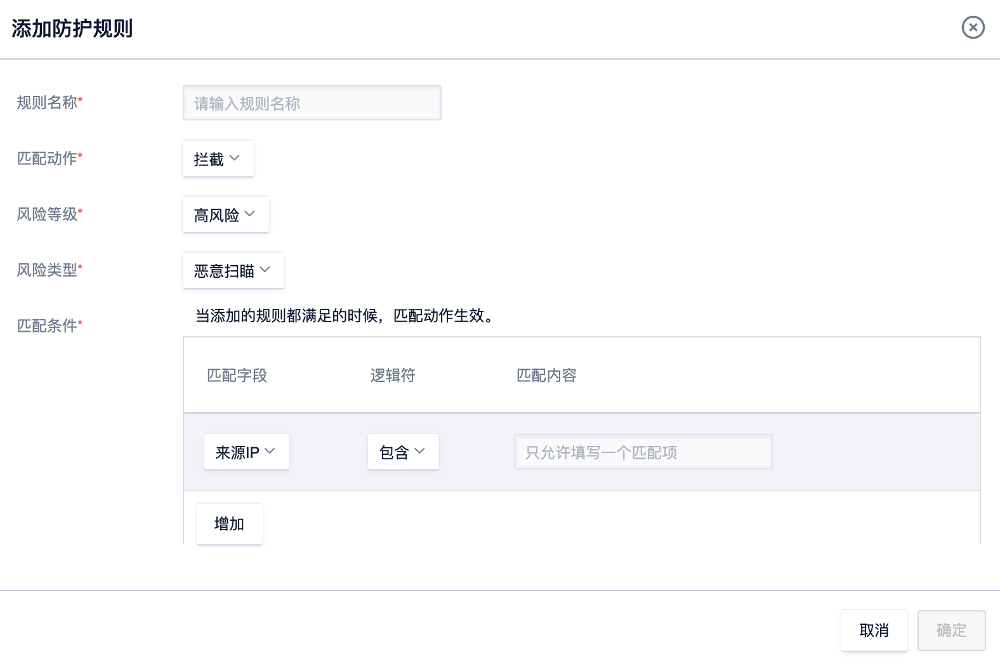

{{indexmenu_n>1}}

# WAF 防护规则

**工作模式：**包含3种工作模式，阻断模式，告警模式和放行模式。

* **阻断模式**：则将根据防护规则进行拦截和放行
* **告警模式**：将根据防护规则生成告警，但是不拦截
* **放行模式**：不会产生任何告警，所有的访问都将被放行

**添加规则：**添加的规则如果匹配到了攻击情况，将会在安全报表中提示，拦截是否生效由工作模式决定。

**优先级排序：**默认规则一直处于最低优先级，无法进行调整。自定义的规则支持调整规则的优先级，根据优先级匹配规则。假如优先级在上面的规则与优先级在下面的规则冲突，以上面的规则为准，优先匹配。比如请求路径包含.php，要拦截的优先级高于攻击来源 IP 包含 192.168.1.1 要放行，则 URL 为http://192.168.1.1/123.php，应该采取拦截的策略。

### 添加规则

当工作模式为“记录但不拦截”时，匹配动作只有“监听”，也就是无拦截效果。如果需要“拦截”，请将工作模式改为“启用防护规则”。

**规则名称：**自定义一个规则名称，可以是中文或者英文。

**匹配动作：**监听/拦截，放行。当匹配动作是监听时，报表中会对命中规则的进行告警，并标记为拦截。当匹配动作是拦截时，会产生告警，并进行阻断。当匹配动作是放行时，将不再对符合规则的请求进行阻断。

**风险等级：**包含高风险、中风险和低风险。

**匹配条件：**可以添加多个匹配条件，当添加的规则都满足的时候，匹配动作生效。如果需要只要其中一个条件满足匹配动作就生效的话请添加多条规则。

  - 匹配字段：来源IP、请求路径（也就是URL地址）、UserAgent（HTTP
    Header中包含的一个字段），Referer（header的一部分，当浏览器向web服务器发送请求的时候，一般会带上Referer，告诉服务器我是从哪个页面链接过来的）
  - 逻辑符：包含或者不包含
  - 匹配内容：根据匹配字段填写对应的匹配内容，比如匹配字段选择的是来源IP，则此处可以填写一个IP地址。
  - 操作：删除当前条件，至少保留一条条件。

参数说明：

  - 规则名称：自定义一个规则名称，可以是中文或者英文。
  - 匹配动作：监听/拦截，放行。当匹配动作是监听时，报表中会对命中规则的进行告警，并标记为拦截。当匹配动作是拦截时，会产生告警，并进行阻断。当匹配动作是放行时，将不再对符合规则的请求进行阻断。
  - 风险等级：包含高风险、中风险和低风险。
  - 风险类型：用户可以指定该条规则为那种攻击类型。
  - 匹配条件：可以添加多个匹配条件，当添加的规则都满足的时候，匹配动作生效。如果需要只要其中一个条件满足匹配动作就生效的话请添加多条规则。

匹配字段详解：

  - 来源IP、请求路径（也就是URL地址）、UserAgent（HTTP
    Header中包含的一个字段），Referer（header的一部分，当浏览器向web服务器发送请求的时候，一般会带上Referer，告诉服务器我是从哪个页面链接过来的）
  - 逻辑符：包含或者不包含，等于或者不等于，正则
  - 匹配内容：根据匹配字段填写对应的匹配内容，比如匹配字段选择的是来源IP，则此处可以填写一个IP地址。
  - 操作：删除当前条件，至少保留一条条件。

### 编辑规则

可参见添加规则。

### 删除规则

删除规则后此条规则不再生效，也无法复原。

### 调整优先级

可以上下调整每条规则的优先级，排列在上面的规则优先级高于排在下面的规则。

优先级高的规则如果与优先级低的规则冲突，则以优先级高的为准。

系统的默认规则优先级一直都是最低的。无法进行调整。

